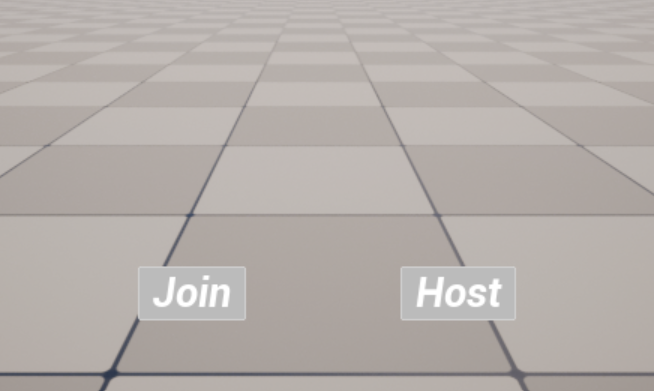
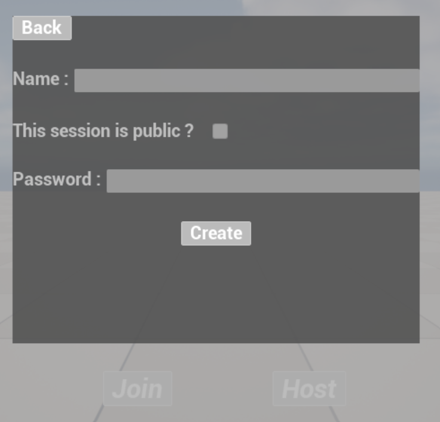
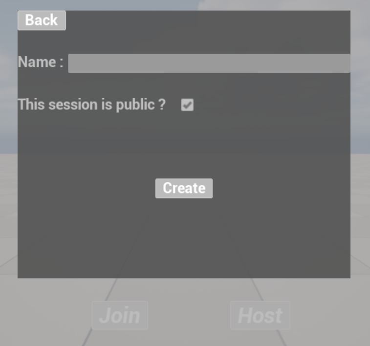
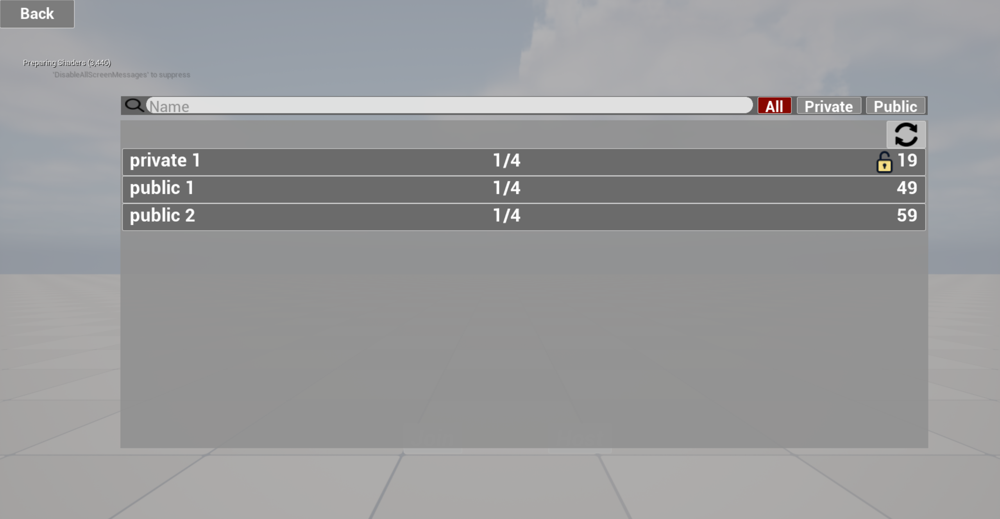
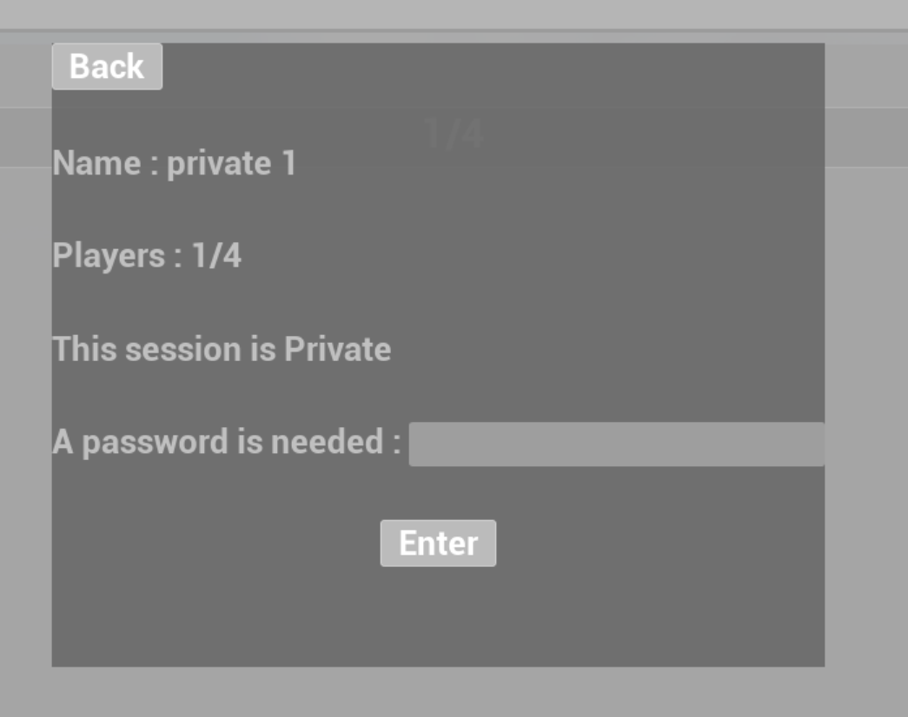
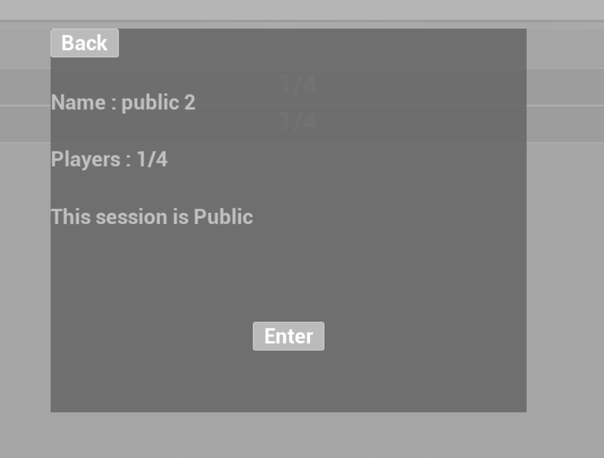

# UnrealOnlineToolbox

## Requirement
* Unreal Engine 5.1 +
* C++ project

## Installation guide
1. Download the content of this repository.
2. Extract files to the folder plugin of your Unreal5.1+ project. 
Your project should look like this :
   - YOUR_GAME/Plugins/UnrealOnlineToolbox/
3. Open your Unreal project and go to Settings > Plugins > "OnlineToolbox" to enable it.
4. Close Unreal and make sure that your c++ project is build. If the build failed, follow next instructions :
   - Delete following folders : /Binaries, /Intermediate, /DerivedDataCache, /Plugins/OnlineToolbox/Binaries, /Plugins/OnlineToolbox/Intermediate 
   - Regenerate project solution (right click on the .uproject file > generate Visual Studio code solution)
   - Open the new solution with your IDE (prefer Rider if you can)
   - Build your project and run it with your IDE.
5. You should now have a new plugins folder in your Unreal project tree.

## Session subsystem :
The session subsystem allow you to connect many players to a session of even to chose which session a player want to join.
This plugin work out of the bow with the null subsystem but you can use any online subsystem if you add the correct configuration to your project.

* Steam : <a href="https://docs.unrealengine.com/4.26/en-US/ProgrammingAndScripting/Online/Steam/">the unreal documentation</a>
* Epic Game : <a href="https://docs.unrealengine.com/4.27/en-US/ProgrammingAndScripting/Online/EOS/">the unreal documentation</a>

/!\ By default Unreal Engine lock the max connexion to 16 players. If you want to override this value add the following line in `YOUR_GAME/Config/DefaultGame.ini`
> [/Script/Engine.GameSession]   
> MaxPlayers=100

Of curse you can replace the value by any number you want.

### Quick start
If you wan to test quickly if the system if good for you, you can add the `WBP_SessionsMenu_BasicSystem` to your menu.
Be sure to open it once and set the lobby map you want to use. Once you did it run twice your menu level with the standalone mode.
Create a session with the first one and join it with the second. You are know able to connect tow or more players in a session.

**Host** : This button create a session with static parameters and move the local player to the lobby map.

**Join** : This button search for sessions, if the system found at least one compatible session it join it.

### Complex Session system
The complex system allow you to customize the session you create and choose which session you want to join.

#### Create a new session

Set the name and the visibility of your session. If you choose private session, give a password that will be required to join it after. Finally create your session.

#### Search and join a session
When you click on the join button you'll find a session's list. On the top of the search panel you can specify details to search one session. (Search by visibility or by name)

Click on any row to get more details and to join the corresponding session.

**Congratulation you can now use this system in your games !**

## Identity subsystem

## Achievements subsystem